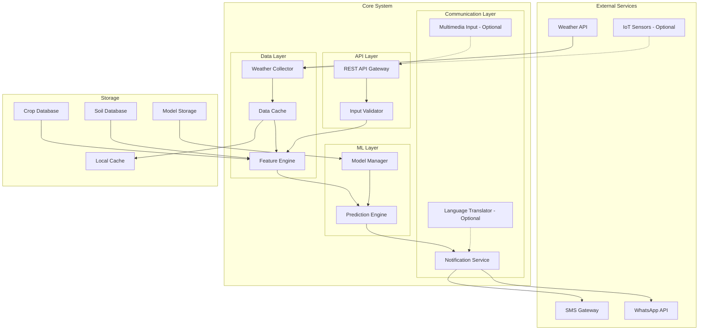

# Design Document: AI-Powered Irrigation Prediction System

## Overview

The AI-powered irrigation prediction system is a cloud-based service that combines meteorological data, agricultural science principles, and machine learning to provide intelligent irrigation recommendations to farmers. The system leverages the FAO Penman-Monteith method for evapotranspiration calculations, enhanced with ML models trained on historical irrigation effectiveness data.

The architecture follows a microservices pattern with clear separation between data collection, feature engineering, ML prediction, and notification delivery. This design supports the scalability requirements for thousands of concurrent users while maintaining the flexibility to add optional features like IoT integration and multimedia inputs.

## Architecture



## Components and Interfaces

### Weather Collector Service
**Responsibility**: Fetches and caches meteorological data from external APIs

**Key Methods**:
- `fetchWeatherForecast(latitude: float, longitude: float, days: int) -> WeatherData`
- `getCachedWeather(location: Location, maxAge: Duration) -> Optional<WeatherData>`
- `validateWeatherData(data: WeatherData) -> ValidationResult`

**Data Sources**: OpenWeatherMap API, AccuWeather API (fallback)
**Caching Strategy**: 6-hour cache with automatic refresh
**Error Handling**: Graceful degradation to cached data with accuracy warnings

### Feature Engineering Service
**Responsibility**: Transforms raw inputs into ML-ready features using agricultural science principles

**Key Methods**:
- `calculateEvapotranspiration(weather: WeatherData, crop: CropProfile) -> float`
- `computeSoilWaterBalance(soil: SoilProfile, weather: WeatherData, irrigation: IrrigationHistory) -> float`
- `generateMLFeatures(inputs: RawInputs) -> FeatureVector`

**Core Calculations**:
- FAO Penman-Monteith reference evapotranspiration (ET₀)
- Crop coefficient (Kc) adjustment based on growth stage
- Soil water holding capacity and drainage characteristics
- Weather-based stress factors (temperature, humidity, wind)

### Prediction Engine
**Responsibility**: Generates irrigation timing and quantity predictions using trained ML models

**Model Architecture**: Ensemble of regression models
- **Primary Model**: Random Forest Regressor for robust predictions
- **Secondary Model**: Gradient Boosting for handling non-linear relationships
- **Fallback Model**: Linear regression for interpretability and reliability

**Key Methods**:
- `predictIrrigationTiming(features: FeatureVector) -> PredictionResult`
- `predictIrrigationQuantity(features: FeatureVector) -> PredictionResult`
- `calculateConfidenceScore(prediction: PredictionResult) -> float`

**Output Format**:
```python
class IrrigationRecommendation:
    timing_days: int  # Days until next irrigation
    quantity_mm: float  # Water depth in millimeters
    confidence: float  # Prediction confidence (0-1)
    reasoning: str  # Human-readable explanation
```

### Notification Service
**Responsibility**: Delivers recommendations via SMS and WhatsApp with optional language support

**Key Methods**:
- `sendSMSNotification(phoneNumber: str, message: str) -> DeliveryResult`
- `sendWhatsAppMessage(phoneNumber: str, message: str) -> DeliveryResult`
- `formatRecommendation(prediction: IrrigationRecommendation, language: str) -> str`

**Message Template**:
```
🌾 Irrigation Alert
Crop: [CROP_NAME]
Next watering: [X] days
Amount: [Y] mm
Reason: [WEATHER_CONDITION]
Confidence: [HIGH/MEDIUM/LOW]
```

**Delivery Strategy**:
1. Attempt WhatsApp delivery first (if available)
2. Fallback to SMS if WhatsApp fails
3. Retry failed deliveries up to 3 times with exponential backoff

### Optional IoT Integration Service
**Responsibility**: Collects and processes real-time sensor data when available

**Supported Sensors**:
- Soil moisture sensors (capacitive/resistive)
- Temperature and humidity sensors
- pH sensors
- Light intensity sensors

**Key Methods**:
- `collectSensorData(deviceId: str) -> SensorReading`
- `validateSensorData(reading: SensorReading) -> ValidationResult`
- `fuseSensorWithWeatherData(sensor: SensorReading, weather: WeatherData) -> EnhancedFeatures`

## Data Models

### Core Data Structures

```python
@dataclass
class WeatherData:
    temperature_max: float  # °C
    temperature_min: float  # °C
    humidity: float  # %
    wind_speed: float  # m/s
    precipitation_probability: float  # %
    solar_radiation: float  # MJ/m²/day
    forecast_date: datetime
    location: Location

@dataclass
class CropProfile:
    crop_type: str  # e.g., "rice", "wheat", "cotton"
    variety: str  # specific variety if known
    growth_stage: GrowthStage  # initial, development, mid, late
    planting_date: datetime
    crop_coefficient: float  # Kc value for current stage
    root_depth: float  # meters

@dataclass
class SoilProfile:
    soil_type: SoilType  # clay, loam, sand, etc.
    water_holding_capacity: float  # mm/m
    drainage_rate: float  # mm/day
    organic_matter: float  # %
    ph_level: float
    bulk_density: float  # g/cm³

@dataclass
class IrrigationRecommendation:
    farmer_id: str
    timing_days: int
    quantity_mm: float
    confidence_score: float
    reasoning: str
    generated_at: datetime
    valid_until: datetime
```

### Database Schema

**Farmers Table**:
- farmer_id (UUID, primary key)
- phone_number (encrypted)
- preferred_language (optional)
- notification_preference (SMS/WhatsApp)
- location (latitude, longitude)

**Crop_Profiles Table**:
- profile_id (UUID, primary key)
- farmer_id (foreign key)
- crop_type, variety, growth_stage
- planting_date, expected_harvest_date

**Soil_Profiles Table**:
- profile_id (UUID, primary key)
- farmer_id (foreign key)
- soil_type, water_holding_capacity, drainage_rate
- ph_level, organic_matter, bulk_density

**Prediction_History Table**:
- prediction_id (UUID, primary key)
- farmer_id (foreign key)
- recommendation (JSON)
- actual_irrigation (JSON, optional)
- effectiveness_score (float, optional)

## Correctness Properties

*A property is a characteristic or behavior that should hold true across all valid executions of a system-essentially, a formal statement about what the system should do. Properties serve as the bridge between human-readable specifications and machine-verifiable correctness guarantees.*

### Weather Data Properties

**Property 1: Weather data completeness**
*For any* weather API request, the returned forecast data should contain temperature, humidity, precipitation probability, and wind speed for the requested number of days
**Validates: Requirements 1.1, 1.3**

**Property 2: Weather data fallback behavior**
*For any* weather API failure, the system should use cached data and include accuracy warnings in subsequent predictions
**Validates: Requirements 1.2**

**Property 3: Weather data validation**
*For any* weather data input, the system should validate completeness and format before processing
**Validates: Requirements 1.4**

### Input Validation Properties

**Property 4: Agricultural input acceptance**
*For any* valid crop type, growth stage, soil type, or drainage characteristics from the supported databases, the system should accept the input without errors
**Validates: Requirements 2.1, 2.2**

**Property 5: Database validation consistency**
*For any* input validation request, crop types and soil types should be validated against their respective supported databases, rejecting unsupported values
**Validates: Requirements 2.3, 2.4**

**Property 6: Error message generation**
*For any* invalid input, the system should return descriptive error messages that clearly indicate the validation failure
**Validates: Requirements 2.5**

**Property 7: IoT data prioritization**
*For any* scenario where both IoT sensor data and manual inputs are available, the system should prioritize sensor data over manual inputs
**Validates: Requirements 2.6, 2.7**

### Feature Engineering Properties

**Property 8: Feature transformation consistency**
*For any* identical raw data inputs, the feature processor should always produce identical normalized ML features
**Validates: Requirements 3.1**

**Property 9: Evapotranspiration calculation accuracy**
*For any* weather data and crop profile, the calculated evapotranspiration should follow FAO Penman-Monteith method principles and produce values within expected ranges
**Validates: Requirements 3.2**

**Property 10: Missing data handling**
*For any* incomplete input data, the feature processor should handle missing values through imputation without causing system failures
**Validates: Requirements 3.3**

**Property 11: Feature validation bounds**
*For any* generated feature vector, all feature values should fall within their expected ranges and distributions
**Validates: Requirements 3.4**

### Prediction Engine Properties

**Property 12: Prediction completeness**
*For any* valid feature vector, the prediction engine should generate both irrigation timing (in days) and quantity (in millimeters) predictions with confidence scores
**Validates: Requirements 4.1, 4.2, 4.3**

**Property 13: Low confidence flagging**
*For any* prediction with confidence score below the defined threshold, the prediction should be flagged as low-confidence
**Validates: Requirements 4.4**

### Notification Properties

**Property 14: Message formatting completeness**
*For any* irrigation recommendation, the formatted notification should include timing, quantity, and reasoning in simple, actionable text
**Validates: Requirements 5.1, 5.4**

**Property 15: Communication channel fallback**
*For any* notification delivery, the system should attempt WhatsApp first when available and preferred, falling back to SMS when WhatsApp is unavailable
**Validates: Requirements 5.2, 5.3**

**Property 16: Delivery retry behavior**
*For any* failed message delivery, the system should retry up to 3 times before marking as failed
**Validates: Requirements 5.5**

**Property 17: Language localization**
*For any* farmer with regional language preferences enabled, notifications should be sent in their preferred local language
**Validates: Requirements 5.6**

### System Scalability Properties

**Property 18: Request queuing behavior**
*For any* system overload scenario, requests should be queued rather than rejected, and processed in first-in-first-out order
**Validates: Requirements 6.3, 6.4**

### Privacy and Security Properties

**Property 19: Data anonymization**
*For any* farmer data processing, personal identification information should not be stored, and anonymized identifiers should be used throughout the system
**Validates: Requirements 7.1, 7.2**

**Property 20: Data retention compliance**
*For any* data that exceeds its retention period, the system should automatically purge the expired data
**Validates: Requirements 7.5**

### Reliability Properties

**Property 21: Model performance monitoring**
*For any* detected model performance degradation, the system should trigger retraining workflows
**Validates: Requirements 8.2**

**Property 22: Graceful degradation**
*For any* system failure, the system should fall back to cached recommendations rather than complete service failure
**Validates: Requirements 8.4**

**Property 23: Prediction validation**
*For any* generated prediction, when historical irrigation effectiveness data is available, the prediction should be validated against this data
**Validates: Requirements 8.5**

### IoT Integration Properties

**Property 24: IoT sensor integration**
*For any* deployed IoT sensors, the system should integrate with common sensor protocols and collect real-time soil moisture, temperature, and humidity data
**Validates: Requirements 9.1, 9.2**

**Property 25: IoT conflict resolution**
*For any* conflict between IoT sensor data and manual inputs, the system should prioritize sensor data and notify the farmer of the discrepancy
**Validates: Requirements 9.3**

**Property 26: IoT fallback behavior**
*For any* IoT sensor malfunction, the system should gracefully fall back to manual inputs and weather-based predictions
**Validates: Requirements 9.4**

**Property 27: IoT-independent functionality**
*For any* farmer without IoT sensors, the system should provide full functionality using manual inputs and weather data
**Validates: Requirements 9.5**

### Future Enhancement Properties

**Property 28: Multimedia input processing**
*For any* voice command or crop image input (when multimedia support is enabled), the system should process the input correctly and incorporate it into recommendations
**Validates: Requirements 10.3, 10.4**

**Property 29: Backward compatibility**
*For any* system upgrade that adds new optional features, existing functionality should continue to work without modification
**Validates: Requirements 10.5**

## Error Handling

The system implements comprehensive error handling across all components:

### Weather API Failures
- **Timeout Handling**: 30-second timeout with exponential backoff retry
- **Data Quality Issues**: Validation of weather data ranges and completeness
- **Service Unavailability**: Graceful fallback to cached data with accuracy warnings

### ML Model Failures
- **Model Loading Errors**: Fallback to backup model versions
- **Prediction Failures**: Return cached recommendations with low confidence scores
- **Feature Engineering Errors**: Robust handling of missing or invalid data

### Communication Failures
- **SMS/WhatsApp Delivery**: Retry mechanism with alternative channel fallback
- **Network Issues**: Queue messages for later delivery
- **Rate Limiting**: Implement backoff strategies for API rate limits

### Data Validation Errors
- **Input Validation**: Clear error messages for invalid crop/soil data
- **Range Validation**: Bounds checking for all numerical inputs
- **Format Validation**: Schema validation for all data structures

## Testing Strategy

### Dual Testing Approach

The system requires both unit testing and property-based testing for comprehensive coverage:

**Unit Tests** focus on:
- Specific examples of weather data processing
- Edge cases in feature engineering (missing data, extreme values)
- Error conditions and exception handling
- Integration points between services
- Specific crop/soil combinations and their expected outputs

**Property-Based Tests** focus on:
- Universal properties that hold across all valid inputs
- Comprehensive input coverage through randomization
- Invariant preservation across data transformations
- Round-trip properties for data serialization/deserialization

### Property-Based Testing Configuration

**Framework**: Hypothesis (Python) or fast-check (TypeScript/JavaScript)
**Test Configuration**:
- Minimum 100 iterations per property test
- Custom generators for agricultural data (crops, soil types, weather patterns)
- Shrinking enabled for minimal failing examples

**Test Tagging Format**:
Each property test must include a comment referencing its design document property:
```python
# Feature: ai-irrigation-predictor, Property 1: Weather data completeness
def test_weather_data_completeness_property():
    # Property test implementation
```

### Test Data Strategy

**Synthetic Data Generation**:
- Weather data generators covering realistic ranges and seasonal patterns
- Crop profile generators for supported crop types and growth stages
- Soil profile generators based on standard soil classification systems

**Historical Data Integration**:
- Use anonymized historical irrigation data for model validation
- Seasonal weather patterns for realistic test scenarios
- Regional crop calendars for growth stage validation

### Performance Testing

**Load Testing**:
- Simulate 10,000 concurrent farmer requests
- Measure response times under various load conditions
- Test queue behavior during capacity overload

**Stress Testing**:
- Test system behavior with malformed inputs
- Simulate external API failures and recovery
- Test memory usage with large datasets

The testing strategy ensures both functional correctness through property-based testing and practical reliability through comprehensive unit and integration testing.